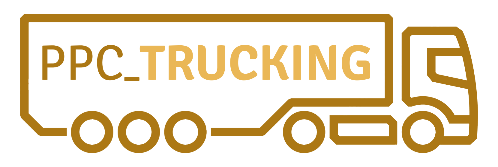

<div align="center">
  

# 🛻🚛 PPC Trucking (open.mp version) 🚌🚗
</div>


This is a modified version of the popular **PPC Trucking** gamemode, originally created by **PowerPC603** for **San Andreas Multiplayer (SA:MP)**.
This version has been updated to work with **open.mp**, the modern, open-source multiplayer mod for Grand Theft Auto: San Andreas.

It includes **MySQL integration** for player data storage and **bcrypt** for secure password hashing.

---
> [!WARNING]  
> Currently, the MySQL integration only handles player data. Other systems such as houses, businesses, cameras, etc., are still stored in .ini files. The migration of these systems to MySQL is actively in progress.
---

## **Features**
- A fully functional trucking gamemode with missions, jobs, and economy systems.
- Compatible with **open.mp**, offering improved performance, stability, and modern features.
- **MySQL Integration**: Persistent data storage for player stats, vehicles, and more.
- **Bcrypt Support**: Secure password hashing for player accounts.
- Includes almost all necessary files and configurations to set up your server quickly.

---

## **Requirements**
- **Grand Theft Auto: San Andreas**.
- **open.mp Launcher**: Download the latest version from [open.mp](https://open.mp/).
- **open.mp Server**: Download the latest version from [open.mp](https://open.mp/).
- **MySQL Server**: For player data storage.
- **PAWN Compiler**: To compile the gamemode (comes included in the `qawno` folder of the server package).
- **Dependencies**:
  - [MySQL Plugin](https://github.com/pBlueG/SA-MP-MySQL).
  - [Bcrypt](https://github.com/Sreyas-Sreelal/samp-bcrypt).
  - [sscanf2](https://github.com/Y-Less/sscanf).
  - [streamer](https://github.com/samp-incognito/samp-streamer-plugin).
  - [zcmd](https://github.com/Southclaws/zcmd).

---

## **Installation**

### **1. Set Up open.mp Server**
1. Download the latest **open.mp server** from the official website: [https://open.mp/](https://open.mp/).
2. Follow the [open.mp installation guide](https://www.open.mp/docs/server/Installation) to set up your server.

### **2. Download the Gamemode**
1. Clone or download this repository
2. Extract the files into your open.mp server directory.

### **3. Set Up MySQL Database**
1. Ensure you have a MySQL server running (e.g., XAMPP, WAMP, or a standalone MySQL server).
2. Create a new database for the gamemode (e.g., `ppctrucking`).
3. Import the database schema file into your MySQL database

### **4. Configure MySQL Connection**
1. Open the `mysql.ini` file in the server directory.
2. Update the connection settings with your MySQL server details. Example:

   ```ini
    hostname = localhost
    username = root
    password = your_password
    database = ppctrucking
   ```

### **5. Install Plugins and Includes**
1. Place the required plugins (e.g., `mysql`, `sscanf`, `streamer`, `samp_bcrypt`) into the `plugins` folder.
2. Place the include files (e.g., `mysql.inc`, `sscanf2.inc`, `zcmd.inc`, `streamer.inc`, `samp_bcrypt.inc`) into the `qawno/includes` folder.

### **6. Configure the Server**
1. Open `config.json` and update the following:
   - Set `rcon_password` to your desired password.
   - Ensure the `gamemode` line points to `PPC_Trucking`.
   - Check the `plugins` line to ensure it loads the required plugins:


   ```json
    "legacy_plugins": [
            "mysql", "samp_bcrypt", "streamer", "sscanf"
    ],
   ```
2. If you’re running the server on **Linux**, ensure the plugins have the `.so` extension (e.g., `mysql.so`).

### **7. Compile the Gamemode**
1. Open `qawno/qawno.exe` (on Windows) or use any compatible IDE.
2. Load `PPC_Trucking.pwn` and compile it.
3. If the compilation is successful, the compiled `PPC_Trucking.amx` file will be generated in the `gamemodes` folder.

### **8. Start the Server**
1. Run the open.mp server executable (`omp-server`).
2. Connect to your server using the open.mp client.

---

## **Credits**
- **PowerPC603**: Original creator of the PPC Trucking gamemode.
- **CodeAlDente**: For maintaining the gamemode.
- **open.mp Team**: For creating and maintaining the open.mp project.
- **pBlueG**: For the MySQL plugin.
- **Sreyas-Sreelal**: For the `samp-bcrypt` plugin.
- **Y_Less**: For the `sscanf` plugin.
- **Incognito**: For the `streamer` plugin.
- **Zeex**: For the `zcmd` command processor.

---

## **License**
This project is licensed under the terms of the original PPC Trucking gamemode. Please respect the licensing terms of all included plugins and libraries.

---

## **Support**
If you encounter any issues or have questions, feel free to:
- Open an issue on the [GitHub repository](https://github.com/PPC-Trucking/PPC_Trucking-for-open.mp/issues).
- Join the [open.mp Discord server](https://discord.gg/openmp) for community support.

---

## **Contributing**
Contributions are welcome! If you’d like to improve this gamemode, please:
1. Fork the repository.
2. Create a new branch for your changes.
3. Submit a pull request with a detailed description of your changes.

---

Enjoy your trucking adventures in **open.mp**! 🚚


